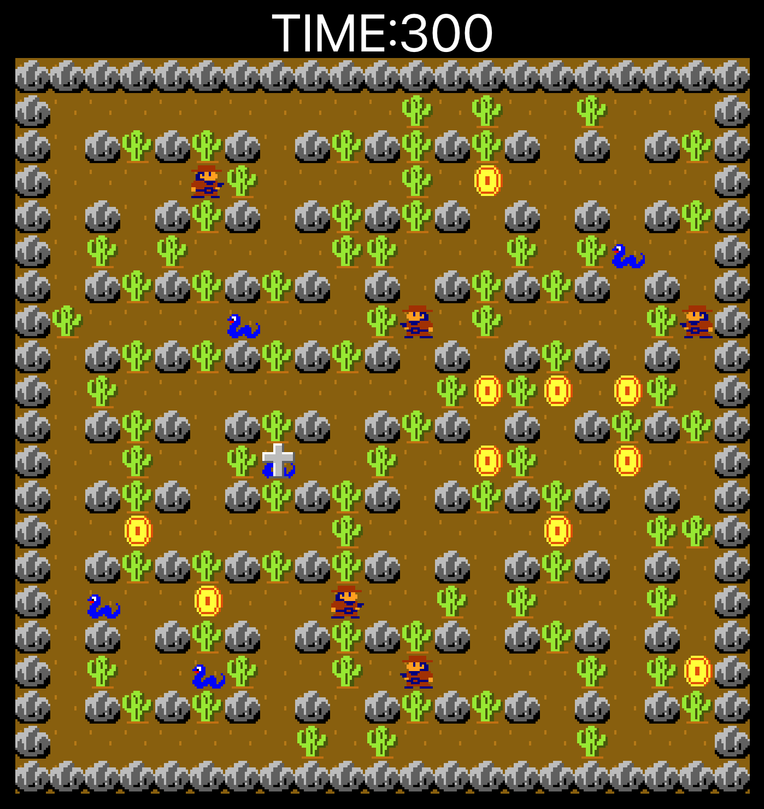

# Kobo-Gunman



## ゲームのルール

制限時間内にたくさんコインを集めた人の勝ち。
ヘビや他のプレイヤーの放った弾に当たるとミス、それまで獲得したコインを失う。

## 準備

```
$ npm i
```

## サーバープログラムのビルド

```
$ npm run build-server
```

## サーバープログラムのスタート

```
$ npm run start-server
```

## フロントのスタート

```
$ npm start
```

## キャラクタの移動

```
$ curl -X POST --header "content-type:application/json" --data '{"action":"down", "index":0 }' http://[IPアドレス]:4000/game
```

index はガンマンの識別子 0 〜 最大プレイヤー数(default:6)まで。

action パラメータの意味

- up 上に移動
- down 下に移動
- left 左に移動
- right 右に移動
- fire 弾発射

## ゲームのコントロール

ゲームリセット

```
$ curl -X POST http://[IPアドレス]:4000/reset
```

ゲームスタート

```
$ curl -X POST http://[IPアドレス]:4000/start
```

ゲームストップ

```
$ curl -X POST http://[IPアドレス]:4000/stop
```

練習モード

```
$ curl -X POST http://[IPアドレス]:4000/mode/train
```

ゲームモード

```
$ curl -X POST http://[IPアドレス]:4000/mode/game
```

迷路モード

```
$ curl -X POST http://[IPアドレス]:4000/mode/maze
```
